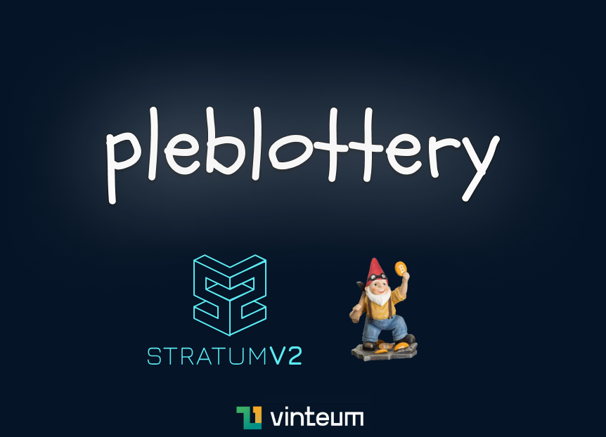
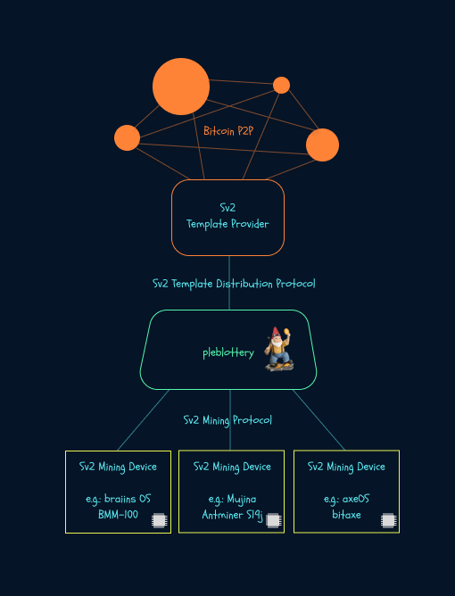

<h1 align="center">
   
  
 
</h1>

⛏️ plebs be hashin ⚡

## intro

`pleblottery` is a Rust-based hashrate aggregator for a pleb-friendly and fully sovereign solo/lottery Bitcoin mining experience over [Stratum V2](https://stratumprotocol.org).

the idea is similar to [`public-pool`](https://github.com/benjamin-wilson/public-pool) and [`ckpool-solo`](https://bitbucket.org/ckolivas/ckpool-solo/), but we're explicitly avoiding the "pool" terminology to avoid ambiguity and confusion.

the coinbase payout goes to one single output, **without any kind of pooled reward distribution**.

`pleblottery` builds on top of [`tower-stratum`](https://github.com/plebhash/tower-stratum) and [Stratum V2 Reference Implementation](https://github.com/stratum-mining/stratum).

<h1 align="center">
   
  
 
</h1>

## instructions

soon™
