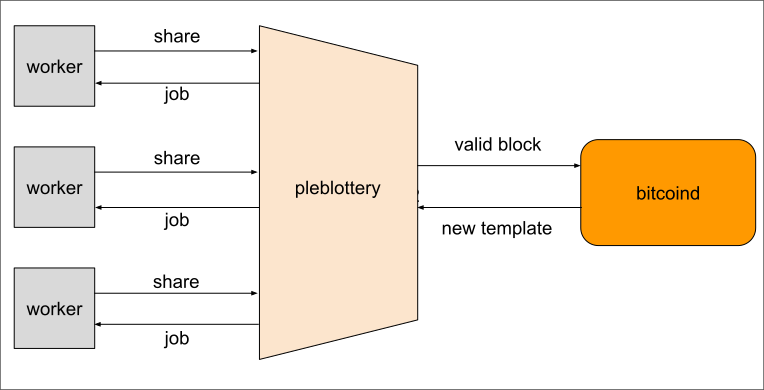

<h1 align="center">
   
  
   
pleblottery
 
</h1>

⛏️ plebs be hashin ⚡

## intro

`pleblottery` is a Rust-based hashrate aggregator for a pleb-friendly and fully sovereign solo/lottery Bitcoin mining experience.

the idea is similar to [`public-pool`](https://github.com/benjamin-wilson/public-pool) and [`ckpool-solo`](https://bitbucket.org/ckolivas/ckpool-solo/), but we're explicitly avoiding the "pool" terminology to avoid ambiguity and confusion.

the coinbase payout goes to one single address, **without any kind of pooled reward distribution**.

## roadmap

- [ ] handle 1 worker via Stratum V1
- [ ] handle multiple workers via Stratum V1
- [ ] handle 1 worker via Stratum V2
- [ ] handle multiple workers via Stratum V2
- [ ] support Sv2 Template Distribution protocol (alternative to GBT)

when multiple workers are supported, `pleblottery` should distribute jobs with proper search space allocation based on worker hashrate.

## instructions

soon™
